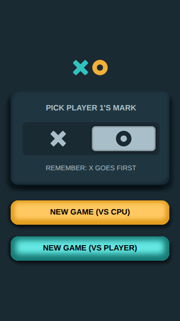
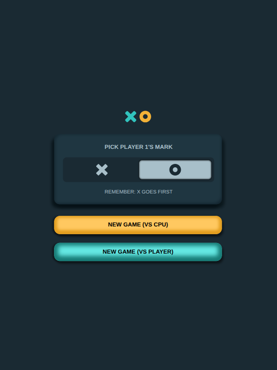
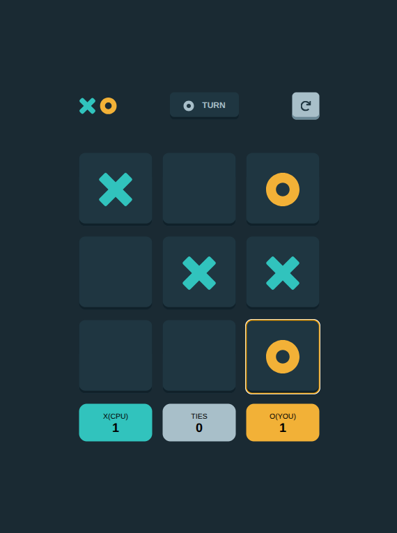
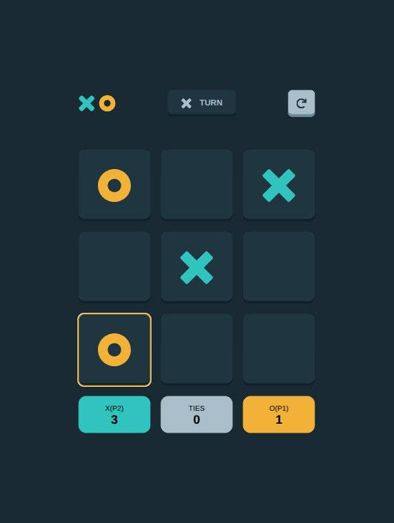

# Frontend Mentor - Tic Tac Toe solution

This is a solution to the [Tic Tac Toe challenge on Frontend Mentor](https://www.frontendmentor.io/challenges/tic-tac-toe-game-Re7ZF_E2v). Frontend Mentor challenges help you improve your coding skills by building realistic projects. 

## Table of contents

# Tic-Tac-Toe (Three in a Row) 

A classic Three in a Row game developed with HTML, CSS, and JavaScript. It allows you to play locally against another player or against the CPU, with a turn-based system, winner detection, tie detection, and game history logging in the browser.

## Features

- ✅ Game for two players or against the CPU.
- ✅ Visual SVG interface for the X and O pieces.
- ✅ Automatic detection of wins and draws.
- ✅ Visual turn indicator.
- ✅ Automatic saving of history in `localStorage`.
- ✅ Dynamic styles when winning (background color + icon).
- ✅ Responsive and accessible.

##  How to play

1. Choose your token (`X` or `O`) using the radio buttons.
2. Select whether you want to play against another player or against the CPU.
3. Click on an empty cell on the board to play.
4. The game will mark the turn and automatically detect if there is a winner or a tie.
5. The result will be saved in the browser history.

##  Game logic

- The board is an array of 9 positions:  
  `let tictoc = Array(9).fill(‘’);`

- Winning combinations are defined as:
```js
const altWin = [
  [0,1,2], [3,4,5], [6,7,8], // horizontal
  [0,3,6], [1,4,7], [2,5,8], // vertical
  [0,4,8], [2,4,6]           // diagonals
];

Translated with DeepL.com (free version)

## Overview

### The challenge

Users should be able to:

- View the optimal layout for the game depending on their device's screen size
- See hover states for all interactive elements on the page
- Play the game either solo vs the computer or multiplayer against another person
- **Bonus 1**: Save the game state in the browser so that it’s preserved if the player refreshes their browser
- **Bonus 2**: Instead of having the computer randomly make their moves, try making it clever so it’s proactive in blocking your moves and trying to win

### Screenshot







### Links

- Solution URL: [Add solution URL here](https://your-solution-url.com)
- Live Site URL: [Add live site URL here](https://your-live-site-url.com)

## My process

### Built with

- Semantic HTML5 markup
- CSS custom properties
- Flexbox
- CSS Grid
- Mobile-first workflow
- Javascript Vanilla

## Author

- Frontend Mentor - [@yourusername](https://www.frontendmentor.io/profile/yourusername)
- Twitter - [@yourusername](https://www.twitter.com/yourusername)

**Note: Delete this note and add/remove/edit lines above based on what links you'd like to share.**

## Acknowledgments

This is where you can give a hat tip to anyone who helped you out on this project. Perhaps you worked in a team or got some inspiration from someone else's solution. This is the perfect place to give them some credit.

**Note: Delete this note and edit this section's content as necessary. If you completed this challenge by yourself, feel free to delete this section entirely.**
